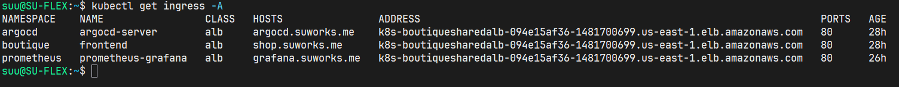

# DOKS → EKS Migration

### `online-boutique-doks-pf` (DigitalOcean) → `online-boutique-eks-pf` (AWS)

This document records the architectural decisions made while porting a production-grade GitOps platform from DigitalOcean Kubernetes to Amazon EKS. It details what changed, why, what stayed identical, and the real incidents encountered along the way. Where DOKS forced a particular design, AWS's managed services often removed that constraint entirely; where AWS introduced new constraints DOKS didn't have, those are called out explicitly rather than glossed over.


## 1. What stayed identical

The platform layer was built Helm-first on DOKS specifically so it would be portable. That paid off: **Argo CD, Kyverno, Falco, Linkerd (mesh + policies), kube-prometheus-stack, Loki, Grafana Alloy, and the entire GitOps sync-wave structure required zero changes.** Same charts, same values files, same 17-application topology. Only the infrastructure underneath, and the handful of components that touch cloud-provider APIs directly, changed.


## 2. Service mapping

| Concern | DOKS | EKS | Why |
|---|---|---|---|
| Kubernetes control plane | DigitalOcean-managed | AWS-managed (`terraform-aws-modules/eks/aws`) | — |
| Compute | 1 DOKS node | EKS Managed Node Group, `m7i-flex.large` × 3 | Fargate was ruled outFalco and Alloy are DaemonSets, which EKS Fargate does not support at all. Not a preference, a hard constraint. |
| Container registry | DigitalOcean Container Registry | Amazon ECR (`online-boutique-eks/*`), scan-on-push enabled | Fresh registry for this project, independent of the earlier ECS-phase registry |
| Public ingress | nginx-ingress (in-cluster pod, DO TCP LoadBalancer in front) | AWS Load Balancer Controller (provisions a real ALB, routing logic lives outside the cluster entirely) | Zero node CPU spent on ingress; managed, autoscaled edge |
| Public TLS | cert-manager + Let's Encrypt, HTTP-01 challenge | ACM, DNS-01 validated once at bootstrap via Terraform | See 3.1 |
| DNS record creation | Manual / DO's integration | external-dns, IRSA-scoped to the `suworks.me` zone only | See 3.2 |
| Internal mTLS CA | cert-manager (self-signed root + identity issuer) | Unchanged; cert-manager + trust-manager | Cloud-agnostic by design; see 3.3 for the one real issue hit |
| Cloud API access from pods | Node-wide, implicit | IRSA; a distinct, scoped IAM role per controller (ALB Controller, EBS CSI, external-dns, External Secrets Operator) | See 3.4 |
| Block storage | DO Block Storage, implicit default StorageClass | `gp3` via `aws-ebs-csi-driver`, explicitly defined and set as cluster default | EKS has no default StorageClass out of the box |
| Application secrets | sealed-secrets (cluster-local keypair) | AWS Secrets Manager + External Secrets Operator, IRSA-authenticated | See 3.5 |
| CI/CD trust | GitHub Actions, OIDC to DigitalOcean | GitHub Actions, OIDC to AWS (separate provider, same principle, zero static cloud credentials in either repo) | — |
|---|---|---|---|

## 3. Key architectural decisions

### 3.1 ACM replaces cert-manager + Let's Encrypt for public TLS

DOKS's own `operations.md` documents a real incident: deny-all `NetworkPolicies` blocking theLet's Encrypt HTTP-01 solver's live validation traffic. That wasn't a one-off misconfiguration, it's a structural conflict between strict zero-trust networking and a validation method that requires an open HTTP path reachable from the internet, and it would recur on every renewal.

ACM's DNS-01 validation sidesteps the conflict entirely: a Route 53 record is created once, in Terraform, at bootstrap (`bootstrap/05_acm.tf`), and no ongoing live traffic path is required, so no NetworkPolicy blocking renewal again. The ALB terminates TLS directly using the ACM certificate; backend traffic to pods is plain HTTP (`server.insecure: true` on Argo CD, equivalent on Grafana), Linkerd's mTLS still encrypts every hop between pods regardless of what the edge is doing.

### 3.2 external-dns replaces manual Route 53 records

The ALB that serves any given Ingress is provisioned by the AWS Load Balancer Controller **inside the cluster**, its DNS name doesn't exist at the moment the Ingress object is created, so a Terraform-managed `aws_route53_record` can't be written ahead of time without a fragile two-phase apply. external-dns is installed once (`cluster/main.tf`, ahead of Argo CD) and watches for a `external-dns.alpha.kubernetes.io/hostname` annotation on any Ingress, writing (and later updating or removing, via `policy: sync`) the Route 53 record automatically. Every current hostname; `argocd.suworks.me`, `grafana.suworks.me`, `shop.suworks.me` and every future one uses the same one-line annotation, no manual DNS step, ever.




### 3.3 Linkerd's trust anchor: from a manually-pasted PEM to `externalCA` + trust-manager

The original DOKS values file hardcoded the cluster's self-signed root CA as a literal PEM string in `identityTrustAnchorsPEM`. That PEM is cryptographically specific to the cluster it was generated on, and if pasted onto a different cluster, it produces exactly the failure hit here: `x509: certificate signed by unknown authority`. The DOKS-era fix path required a manual `kubectl get secret ... | base64 -d` extraction and a hand-edited commit for every fresh cluster.

The fix: `identity.externalCA: true`, combined with **trust-manager** (cert-manager's companion project). cert-manager still generates the root and identity certs exactly as before, in-cluster, self-signed, auto-renewing. trust-manager watches the resulting Secret and continuously syncs its public certificate into a `linkerd-identity-trust-roots` ConfigMap; Linkerd's control plane reads from that ConfigMap instead of a value hardcoded into git. No PEM in source control, on any cluster, this is now a smooth step on a full rebuild.

### 3.4 IRSA: from implicit node-wide access to one scoped role per controller

DOKS had no equivalent concept of scoped cloud API access. Cluster-to-cloud-API access was implicit at the node level. Every controller that communicates with an AWS API here (ALB Controller, EBS CSI driver, external-dns, External Secrets Operator) has its own IAM role, federated to its own Kubernetes ServiceAccount via the cluster's OIDC provider, scoped to only what that specific controller needs. e.g. external-dns can `route53:ChangeResourceRecordSets` only within the `suworks.me` zone, not `route53:*`; External Secrets Operator can `secretsmanager:GetSecretValue` only under the `online-boutique/*` path.

### 3.5 Secrets: from a per-cluster keypair to AWS Secrets Manager + External Secrets Operator

sealed-secrets encrypts against a keypair generated fresh per cluster. Every sealed secret committed from the DOKS cluster became permanently undecryptable ciphertext the moment it was applied to a different cluster it is not a bug to patch once, but a failure mode that recurs on every future cluster rebuild or migration. This is exactly what happened to the Grafana admin credential during this migration (S.4).

The fix moves the secret's source outside the cluster's lifecycle entirely: Terraform creates the AWS Secrets Manager entry (`bootstrap/06_secrets.tf`), its value seeded from a GitHub Actions secret (the one value in the entire pipeline that legitimately can't live in a committed file, the same trust boundary already used for the OIDC role ARN and the Route 53 zone ID). External Secrets Operator, authenticated via its own IRSA role, syncs that value into a normal Kubernetes `Secret` inside the cluster. A full cluster rebuild now regenerates this chain
automatically, with no manual re-encryption step, ever.


## 4. Real incidents encountered during the build

Kept here deliberately, DOKS-`operations.md`-style, these are the specific, non-obvious things that actually broke, with root cause, not just the fix.

**Pod-count ceiling, not a resource shortage.** Every microservice, Linkerd, Loki, Kyverno, and Prometheus pod stuck `Pending` with `0/1 nodes are available: 1 Too many pods`, while CPU sat at 65% and memory at 21%. AWS caps pods per node by ENI/IP capacity, not by compute headroom; `m7i-flex.large` tops out around 29 pods regardless of how much CPU or memory is free. This was resolved by scaling the node group, not by resizing pods.

**A shared ALB group's single misconfigured member blocks the entire group.** Argo CD's and Grafana's Ingresses were intentionally grouped under one `alb.ingress.kubernetes.io/group.name` to share a single ALB. The AWS Load Balancer Controller builds one combined model per group, Grafana's Ingress was missing `target-type: ip` (defaulting to `instance` mode, incompatible with its `ClusterIP` Service), and that single error silently blocked the *entire* group's model from deploying, including Argo CD's own listener, even though Argo CD's own annotations were correct. The controller's `FailedBuildModel` event named the actual broken member; the symptom appeared on
an unrelated, correctly-configured Ingress.

**`templatefile()` vs `file()` + a merged values object are not equivalent.** An early attempt to inject the ACM certificate ARN into Argo CD's Helm values used `file()` to read the values YAML verbatim and `yamlencode()` to merge in a separate object containing the ARN. Helm merges the two values objects, but merging isn't string substitution, the `${acm_certificate_arn}` placeholder inside the first file was never touched, and the literal string reached the deployed Ingress annotation, which AWS then rejected outright (`Certificate ARN '${acm_certificate_arn}' is not valid`). `templatefile(path, vars)`, a single function call that performs real substitution before Helm ever sees the content was required.

**External Secrets Operator's CRDs exceed Kubernetes' 256KiB annotation limit.** ESO's `ClusterSecretStore`/`SecretStore` CRDs are among the largest in the ecosystem their combined schema across a dozen+ supported providers exceeds the size Kubernetes allows in the `kubectl.kubernetes.io/last-applied-configuration` annotation used by client-side apply. Fixed with `ServerSideApply=true` (avoids that annotation entirely going forward) combined with `Replace=true` (needed once, to clear the CRD objects that were already poisoned by three earlier failed client-side-apply attempts).

**A single stuck finalizer blocks an entire App-of-Apps sync queue.** Deleting `linkerd-viz`'s source file from git should have pruned it on the next sync. Instead, the root Application's
sync operation sat in `Running` indefinitely `waiting for deletion of argoproj.io/Application/linkerd-viz` because the underlying `Application` object's `resources-finalizer.argocd.argoproj.io` finalizer never cleared. Since Argo CD won't start a new sync while a previous one is still running, every other Application queued behind root (`prometheus`, `kyverno-controller`, `external-secrets`) appeared stuck for unrelated reasons they weren't broken individually, they were blocked by one unrelated stuck deletion. Clearing the finalizer directly (`kubectl patch application linkerd-viz --type merge -p'{"metadata":{"finalizers":[]}}'`) unblocked the entire queue at once.

**EKS node group scaling has a mid-update validation ordering gap.** Raising `min_size` and `desired_size` in the same Terraform apply (`1→2` and `1→2` respectively) failed with `Minimum capacity 2 can't be greater than desired size 1` the API validates the new `min` against the *old* `desired`, mid-transaction. Resolved by leaving `min_size` at its prior value and only raising `desired_size` in that apply.

---

## 5. What would change at real production scale

- A dedicated KMS customer-managed key per secret category, rather than the AWS-managed default
  key, that is proportionate for a portfolio-scale project as-is, but a real production security team
  would likely require CMK-level control over rotation and access policy
- Karpenter or cluster-autoscaler instead of a static managed node group, to absorb pod-count
  pressure automatically rather than requiring a manual `desired_size` change
- A dedicated CMK-backed audit trail on Secrets Manager access, and Secrets Manager automatic
  rotation for anything longer-lived than a Grafana admin password
- Multi-account separation (this project runs in a single AWS account across foundation,
  network, and platform layers appropriate for a single-owner portfolio, not for a real
  multi-team org)

---

## 6. Repository structure reference

```
online-boutique-eks-pf/
├── infrastructure/envs/prod/
│   ├── 01_iam.tf, 02_ecr-bootstrap.tf        # Account foundation; state 1
│   ├── bootstrap/                             # VPC, EKS, IRSA, ACM, Secrets Manager; state 2
│   └── cluster/                                # Namespaces, ALB Controller, external-dns, Argo CD; state 3
├── clusters/boutique/
│   ├── argocd/                                 # root-app.yaml, the one Terraform→Argo CD handoff point
│   ├── infrastructure-apps/                    # 17 Argo CD Applications
│   └── platform-configs/                       # Helm values, Kyverno policies, cert-manager/trust-manager chain, secrets
├── apps/boutique/                               # Kustomize manifests, ECR-sourced images
└── .github/workflows/
    ├── eks-bootstrap.yml
    └── eks-cluster.yml
```